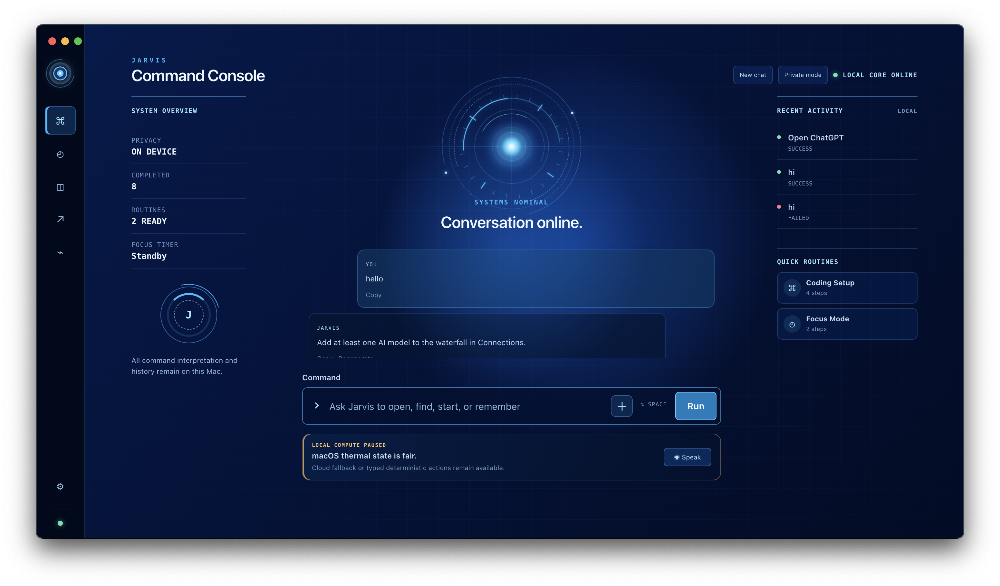

# Jarvis

Jarvis is an open-source desktop assistant for people who want a private, local-first command center on their own computer.

It can chat, open apps and websites, remember useful notes, run simple routines, connect to optional AI providers, and keep your data on your machine by default. There is no Jarvis account, no bundled API keys, no telemetry service, and no arbitrary shell execution.



> Early project: Jarvis is usable today, but it is still being tested across more computers. Start carefully, review important actions, and avoid attaching private data when reporting issues.

## Download

Get the latest build from the [GitHub Releases page](https://github.com/vivaanseth/jarvis/releases).

Current release assets include:

- macOS universal: `.dmg`, `.zip`, and `.tar.gz`
- Windows x64: setup `.exe` and `.msi`
- Linux x64: `.AppImage`, `.deb`, `.rpm`, and `.tar.gz`
- `SHA256SUMS.txt` for checksum verification
- `latest.json` for release metadata
- GitHub source archives at the bottom of each release page

macOS is the best-supported platform right now because Jarvis uses a small native companion for Apple permissions, speech, OCR, app control, Shortcuts, and the floating orb. The Electron app, conversations, notes, timers, browser opening, local files, connectors, and bring-your-own AI providers also run on Windows and Linux, but macOS-only features will show as unavailable there.

## What Jarvis Does

Jarvis is meant to help with everyday computer tasks without pretending to be an unlimited autonomous agent.

- Chat with local or bring-your-own AI models.
- Open apps, folders, files, websites, and common services like ChatGPT, Gmail, YouTube, GitHub, Maps, and Spotify.
- Run routines, timers, focus sessions, and reminders.
- Save local notes and useful memories.
- Search the web with an optional Tavily key, or fall back to opening browser searches.
- Connect optional services like Google Workspace, GitHub, Microsoft 365, Notion, Todoist, Spotify, OpenRouter, Groq, Gemini, Mistral, Ollama, LM Studio, and NVIDIA NIM.
- Use voice input on macOS when microphone and speech permissions are available.
- Keep risky actions behind previews and confirmations.

Jarvis will not silently send messages, delete files permanently, run random shell commands, read passwords, solve CAPTCHAs, or submit sensitive forms for you.

## Quick Start

1. Download the installer for your operating system from [Releases](https://github.com/vivaanseth/jarvis/releases).
2. Open Jarvis.
3. Follow the setup screen.
4. Add optional AI keys or local models in **Connections**.
5. Try simple requests like:

```text
Open ChatGPT
Search YouTube for macOS shortcuts
Start a 25 minute focus timer
Remember that my main project is Jarvis
Summarize this note
```

You can use Jarvis without cloud AI, but conversation quality depends on the models you connect. Local models through Ollama or LM Studio can reduce API usage, and Jarvis checks system pressure before using them.

## Privacy

Jarvis is designed for one person using their own computer.

- App data is stored locally.
- API keys and tokens are encrypted locally where supported.
- Private Mode avoids saving conversations, memory, attachments, and activity.
- AI providers are optional and bring-your-own-key.
- Jarvis does not include analytics, telemetry, or a hosted Jarvis account.
- Documents and screenshots are not sent to cloud AI unless you approve that request.

On macOS, app data lives in:

```text
~/Library/Application Support/Jarvis/
```

The main files are:

- `jarvis.sqlite`: structured local database
- `state.json`: portable compatibility snapshot
- `memory.md`: human-readable memory mirror
- `secrets.json`: encrypted credential storage

## Safety

Jarvis sorts actions by risk.

- Low-risk actions can run with visible progress.
- Medium-risk actions ask for confirmation by default.
- High-risk actions always require a final confirmation.
- Sending emails or messages, changing calendars, deleting files, account changes, purchases, shutdown, and restart are treated carefully.
- Permanent deletion, `sudo`, arbitrary shell text, hidden screen capture, and silent external communication are unsupported.

AI models can suggest actions only through Jarvis capability definitions. Jarvis validates the action again before anything runs.

## Optional Connections

Open **Connections** inside Jarvis to configure services.

AI providers:

- Ollama
- LM Studio
- OpenRouter
- Groq
- Gemini
- Mistral
- NVIDIA NIM

Productivity and web connectors:

- Google Workspace
- GitHub
- Microsoft 365
- Notion
- Todoist
- Tavily
- Spotify
- Chrome extension bridge

Jarvis only exposes connector actions after the connection is healthy. If a connector is missing, expired, or missing required scopes, Jarvis should explain what needs to be fixed instead of failing with a raw error.

## Build From Source

For development, use Node.js 24 or newer.

```bash
npm install
npm start
```

Run the main checks:

```bash
npm run check
npm test
```

On macOS, full native verification also needs Xcode:

```bash
./script/build_and_run.sh --verify
```

Build the native macOS companion:

```bash
./script/build_native_bridge.sh
```

Package release builds:

```bash
npm run package:release
```

## Release Status

Public releases are built with GitHub Actions. They currently include unsigned installer artifacts plus SHA-256 checksums. Real `.sig` files, Apple notarization, and Windows code signing require signing credentials and should not be faked.

Before publishing a fork, run:

```bash
npm run security:secrets
```

If a real credential was ever committed, revoke it. Removing it from the repo is not enough.

## License

Jarvis uses the [MIT License](LICENSE).

MIT gives people clear permission to use, modify, and share the code while keeping the project simple and easy to contribute to.

## More Information

- [Architecture](ARCHITECTURE.md)
- [Capabilities](Docs/CAPABILITIES.md)
- [Privacy](Docs/PRIVACY.md)
- [Permissions](Docs/PERMISSIONS.md)
- [Troubleshooting](Docs/TROUBLESHOOTING.md)
- [Release workflow](Docs/RELEASE.md)
- [Contributing](CONTRIBUTING.md)
- [Security policy](SECURITY.md)
